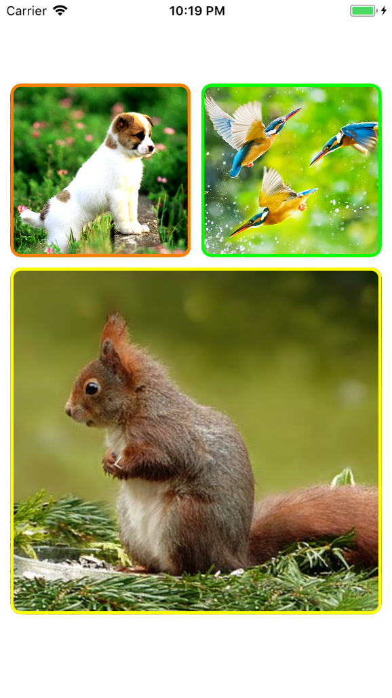

# ABCollage

[](https://travis-ci.org/andreasbagias@gmail.com/ABCollage)
[](https://cocoapods.org/pods/ABCollage)
[](https://cocoapods.org/pods/ABCollage)
[](https://cocoapods.org/pods/ABCollage)

## Example

<a href="https://imgflip.com/gif/2a6ijg"></a>
{:height="700px" width="400px"}

## Installation

ABCollage is available through [CocoaPods](https://cocoapods.org). To install
it, simply add the following line to your Podfile:

```ruby
pod 'ABCollage'
```

## Author

andreas bagias, andreasbagias@gmail.com

## License

ABCollage is available under the MIT license. See the LICENSE file for more info.
